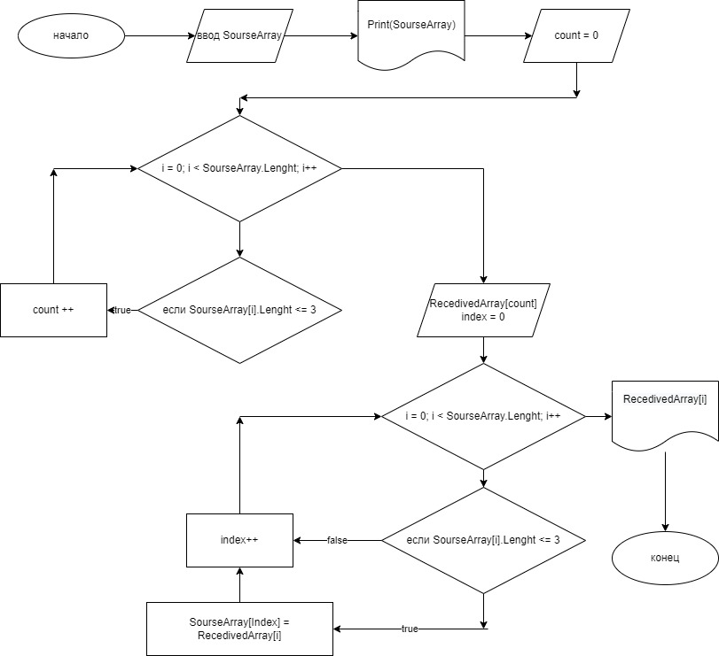

#  Вводный курс. Контрольная работа.

## Определяем методы.

1. Со 2-ой по 7-ю строку записываем метод FillArray1 ввода елементов массива 1 типа string. Элементы вводятся через пробел. Возвращаем массив типа string.
2. С 9-ой по 16-ю строку описывае метод PrintArray печати элементов массива с помрощью цикла for в одну строку.
3. С 18-ой по 26-ю строку описываем метод LengthArray2 определения количества элементов массива 1, длина которых меньше или равна 3.На вход данных берём массив типа string. Вводим переменную count. С помощью цикла for перебираем все элементы и если длинна элемента меньше или равна трём то увеличиваем count на 1. Возвращаем значение count типа int.
4. С 28-ой по 41-ю строку описываем метод FillArray2. На вход берём данные, число count типа int и массив array типа string. Вводим переменную index типа int(она будет определять индекс заполняемого массива). Вводим массив array2 типа string, длина которго равна числу из входных данных, его мы будем заполнять. С помощью цикла for перебираем все элементы массива array и если элемент массива имеет длину меньшую или равную трём то присваиваем его значение элементу массива array2 с индексом равным index, а затем увеличиваем index на 1.

# Выполнение прграммы.

1. Строка 43. Задаём массив SourceArray и заполняем его с помощью метода FillArray1.
2. Строка 44. задаём массив ReceivedArray и заполняем его с поьощью метода FillArray2. В качестве первого аргумента используем данные полученные с помощью метода LengthArray2 где на вход даём массив SourceArray. В качестве вторго аргумента задаём SourceArray.
3. Строка 45. Печатаем массив SourceArray.
4. Строка 46. Печатаем массив ReceivedArray.

